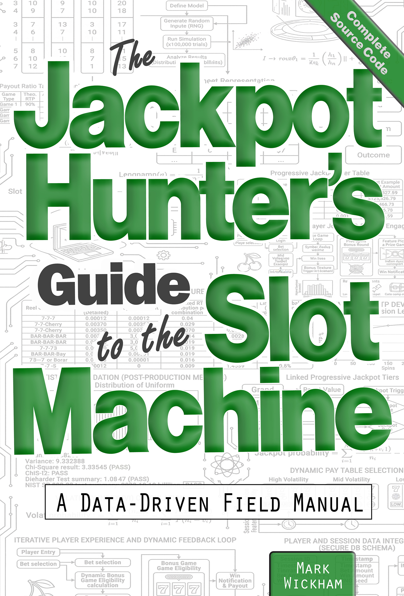

# Jackpot Hunters



### Companion Repository for

## *The Jackpot Hunter's Guide to the Slot Machine*

### A Data-Driven Field Manual

**[Available on Amazon](https://a.co/d/03UfHhzU)**

This repository contains the **Python analysis scripts, datasets, and generated outputs** used in the book:

> **The Jackpot Hunter's Guide to the Slot Machine — A Data-Driven Field Manual**

The purpose of this repository is to provide readers with **reproducible analysis tools** that explore public casino data, including slot machine hold percentages, jackpot distributions, denomination performance, and regional comparisons.

The scripts allow readers to **replicate the statistical analysis used in the book**, explore new datasets, and develop their own insights into slot machine behavior.

------

# Repository Structure

```
Jackpot-Hunters/
│
├─ Nevada/
│   Scripts and output for Nevada Gaming Control Board analysis
│
├─ New-Jersey/
│   Scripts and output for NJ Division of Gaming Enforcement analysis
│
├─ Atlantic-City/
│   Scripts and output for AC annual slot and table game analysis
│
├─ Math-package/
│   Slot machine math simulator and configuration files
│
├─ Financial-reports/
│   Scripts for downloading and scanning casino SEC filings
│
├─ Spreadsheets/
│   Excel session tracking spreadsheets
│
└─ README.md
```

### Key directories

| Directory              | Description                                                          |
| ---------------------- | -------------------------------------------------------------------- |
| **Nevada/**            | Scripts and output for Nevada Gaming Control Board analysis          |
| **New-Jersey/**        | Scripts and output for NJ jackpot analysis                           |
| **Atlantic-City/**     | Scripts and output for Atlantic City hold percentage analysis        |
| **Math-package/**      | Slot machine math model simulator and supporting config files        |
| **Financial-reports/** | SEC filing downloader and scanner scripts                            |
| **Spreadsheets/**               | Excel spreadsheets for tracking playing sessions                     |

------

# Purpose of the Repository

This repository supports the **data-driven approach described in the book** by allowing readers to:

• Analyze **public gaming reports**
 • Compare **casino regions and machine performance**
 • Examine **slot machine hold percentages**
 • Identify **statistical patterns relevant to jackpot hunting**

The scripts transform raw regulatory data into **interpretable metrics for players and researchers**.

------

# Requirements

The scripts require **Python 3.9+** and the following libraries:

```
pip install pandas numpy matplotlib seaborn tabulate tabula-py pypdf openpyxl
```

------

# Running the Scripts

Scripts are organized by jurisdiction. Run them from inside their directory, passing input files as arguments. Outputs are written to the **`output/` directory** by default.

```
cd Nevada
python NV_overview.py docs/NV_2025_01.pdf
```

------

# Analysis Scripts

The analysis scripts are organized into three directories by jurisdiction. Each directory contains its own README with full script documentation and links to the public data sources used.

------

# Nevada

4 scripts analyzing **Nevada Gaming Control Board** monthly reports — win percentages by denomination, location, and casino size tier.

| Script | Description |
| --- | --- |
| `NV_overview.py` | Statewide summary from a single monthly report |
| `NV_win_pct_location_annual.py` | Annual win% trends by denomination for a given location |
| `NV_win_pct_vegas_reno.py` | Side-by-side Strip vs Reno comparison |
| `NV_casino_size.py` | Win% by casino revenue size tier |

**Data source:** https://www.gaming.nv.gov/about-us/gaming-revenue-information-gri/

See [Nevada/README.md](Nevada/README.md) for full documentation and usage.

------

# New Jersey

5 scripts analyzing **NJ Division of Gaming Enforcement** jackpot reports — frequency by casino, denomination, game title, and time patterns.

| Script | Description |
| --- | --- |
| `NJ_jackpots_by_casino.py` | Jackpot frequency ranked by casino |
| `NJ_jackpots_by_denom.py` | Jackpot frequency by denomination |
| `NJ_jackpots_by_denom_3yr_stacked.py` | Three-year denomination comparison |
| `NJ_jackpots_by_game.py` | Top jackpot-paying game titles |
| `NJ_jackpots_by_time.py` | Jackpot patterns by day of week and month |

**Data sources:** https://www.njoag.gov/about/divisions-and-offices/division-of-gaming-enforcement-home/slot-laboratory-tsb/

See [New-Jersey/README.md](New-Jersey/README.md) for full documentation, data source links, and usage.

------

# Atlantic City

1 script analyzing **NJ annual slot and table game revenue reports** — hold percentages by casino and denomination to identify the loosest machines.

| Script | Description |
| --- | --- |
| `AC_hold_percentage.py` | Hold % by casino and denomination — lower = looser |

**Data source:** https://www.nj.gov/oag/ge/docs/Financials/AnnualSlotTableGameData/2024.pdf

See [Atlantic-City/README.md](Atlantic-City/README.md) for full documentation and usage.

------

# Math Package

The `Math-package/` directory contains an **educational slot machine math simulator** that lets readers design their own slot machine and generate a PAR sheet — as described in the book. Every component (reel strips, paytable, paylines, betting config) is defined in plain JSON files you can edit freely.

```
cd Math-package
python simulator.py --spins 1000000 --seed 42
```

**Default PAR sheet (600,000 spins):** RTP 90.41% · Hold 9.59% · Hit frequency 31.69% · Volatility index 4.232

See [Math-package/README.md](Math-package/README.md) for full documentation of the simulator arguments, all JSON configuration files, and PAR sheet output fields.

------

# Financial Reports

The `Financial-reports/` directory contains a two-script **SEC filing research pipeline** — download public casino operator filings, scan them for jackpot-related disclosures, then feed the output into an AI model to generate an analyst report, as described in the book.

```
Step 1: python download_filings.py          →  sec-edgar-filings/
Step 2: python scan_filings.py > scan_results.txt
Step 3: Feed scan_results.txt into an AI model
```

Operators covered: **MGM**, **CZR** (Caesars), **PENN** (Penn Entertainment) · Forms: 10-K and 10-Q · Source: SEC EDGAR

The `scan_findings_summary.md` in that directory shows a completed example report from a March 2026 scan of 39 filings.

See [Financial-reports/README.md](Financial-reports/README.md) for full documentation of both scripts, all arguments, keyword list, and the AI analysis workflow.

------

# Session Tracking Spreadsheets

The `Spreadsheets/` directory contains three Excel spreadsheets for **logging and analyzing your own playing sessions** — as described in the book. No macros required.

| Spreadsheet | Purpose |
| --- | --- |
| **Session-Entry-v2.xlsx** | Primary session tracker — up to 8 visits, spin-by-spin entry, auto-calculates ROI, profit, hit rate, and average hit multiplier |
| **Hit-Multiplier-v1.xlsx** | Long-term spin log — tracks hit multiplier values across many sessions with a running total spin count |
| **Stepper-Graph-Example-v2.xlsx** | Single-session credit balance chart — plots the stepper pattern with an embedded chart that updates as you enter data |

See [Spreadsheets/README.md](Spreadsheets/README.md) for full column descriptions and usage instructions for each spreadsheet.

------

# Educational Purpose

This repository is provided for **educational and analytical purposes**.

The scripts demonstrate how public gaming data can be transformed into statistical insights. They are intended to help readers understand:

• Casino reporting structures
 • Slot machine economics
 • Statistical variance in gambling outcomes

------

# License

This repository is released under the MIT License unless otherwise specified.

------

# Related Book

**The Jackpot Hunter's Guide to the Slot Machine — A Data-Driven Field Manual**

This book explains the statistical framework behind the scripts and shows how to interpret the results.

------

# Contributing

Contributions are welcome.

Potential improvements include:

• Additional state datasets
 • Improved visualization tools
 • Extended statistical analysis